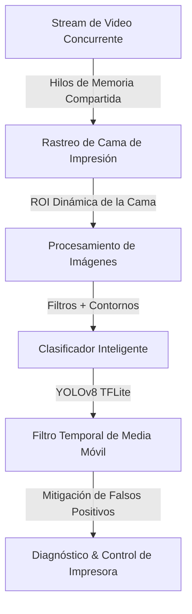

# Spaghetti3D: Monitoreo Inteligente de Fallos en Impresión 3D 🚀

Sistema inteligente de detección de errores de impresión 3D en tiempo real utilizando un pipeline híbrido de **Procesamiento de Imágenes Clásico** y **Deep Learning (YOLOv8 TFLite)**. Diseñado y optimizado para ejecutarse de forma eficiente en dispositivos de borde (*Edge Computing*) como la **Raspberry Pi 4**.

---

## 🛠️ Arquitectura del Pipeline Híbrido

Para maximizar la eficiencia y precisión sin saturar los recursos del dispositivo, el sistema opera bajo un flujo de trabajo concurrente y modular:



1. **Adquisición Concurrente (`camera_stream.py`):** Utiliza un patrón de diseño **Productor-Consumidor** con hilos (`threading`) y colas de memoria compartida para evitar latencias en la cámara causadas por la inferencia de la IA.
2. **Segmentación y ROI (`detector.py`):** Define la región de interés (ROI) en la cama de impresión mediante operaciones morfológicas, aislando el objeto en construcción de elementos distractores del fondo.
3. **Clasificación de Anomalías (`classifier.py`):** Ejecuta inferencia acelerada sobre un modelo YOLOv8 exportado a **TFLite (EfficientNet-Lite)** para evaluar la regularidad de la pieza en construcción frente a fallos como "espagueti" o hilos de plástico desprendidos.
4. **Filtro Temporal de Media Móvil (`logic.py`):** Aplica una ventana de promedio móvil con histéresis matemática para mitigar falsos positivos temporales antes de activar alarmas críticas.
5. **Control de Impresora (`printer_control.py`):** Cliente de comunicación HTTP con la API de OctoPrint o Moonraker para detener automáticamente la máquina en caso de error crítico detectado.

---

## 🔬 Técnicas de Procesamiento de Imágenes Aplicadas

Este proyecto implementa y demuestra de forma práctica conceptos centrales del procesamiento digital de señales e imágenes:

* **Manejo de ROIs (Region of Interest):** Delimitación y aislamiento espacial de la zona útil de la cama de impresión para reducir el ruido visual y la carga de cómputo en hardware limitado.
* **Normalización de Intensidad:** Conversión de matrices de píxeles BGR a RGB y escalado lineal de rangos `0-255` a flotantes `0.0-1.0` para la correcta activación de tensores de la red neuronal.
* **Remuestreo e Interpolación:** Redimensionamiento y muestreo espacial adaptativo de cuadros de video a resoluciones estandarizadas de `640x640`.
* **Filtrado Temporal:** Suavizado y eliminación de ruido de altas frecuencias en las salidas binarias del clasificador usando un filtro de media móvil en el dominio del tiempo.
* **Perfiles de Calibración de Umbral Dinámico:** Mitigación de falsos positivos causados por texturas repetitivas de infill (pirámides, triángulos) adaptando las tolerancias de probabilidad en base al archivo reproducido.

---

## 🚀 Configuración y Uso

### 1. Instalación de Dependencias
Instala las librerías numéricas y de visión artificial requeridas:
```bash
pip install -r requirements.txt
```

### 2. Estructura de Carpetas
Coloca los modelos de IA en la carpeta `models/`:
* `models/anomaly_efficientnet.tflite` (Modelo YOLOv8 de detección de errores)

### 3. Ejecución del Sistema
Puedes correr el sistema pasando la dirección de tu webcam o un archivo de video de prueba:

* **Ejecutar con pieza perfecta (Sana):**
  ```bash
  python main.py --camera videoimp2.mp4
  ```
* **Ejecutar con pieza con fallos de hilos (Alarma Temprana):**
  ```bash
  python main.py --camera videoimp1.mp4
  ```
* **Ejecutar con cámara en vivo (Webcam 0):**
  ```bash
  python main.py --camera 0
  ```

### 🏆 4. MODO PROFESIONAL COMERCIAL (YOLOv11)
Para usar el motor de máxima precisión que instalamos, usa este comando:

```bash
python3 main.py --camera TU_VIDEO.mp4 --classifier_model models/spaghetti_pro.pt
```

*(Alternativamente, puedes ejecutar el atajo interactivo `./ejecutar_pro.sh`)*

---

## 📊 Demostración de Resultados en Tiempo Real

El sistema cuenta con una **interfaz gráfica interactiva integrada en OpenCV** que muestra:
* El estado del diagnóstico actual con códigos de color semafóricos (VERDE: Sano, ROJO: Anomalía Crítica).
* La visualización en tiempo real de la zona de monitoreo bajo la "lupa" de la IA.
* El porcentaje exacto de confianza de la red neuronal sobre el estado del filamento.
